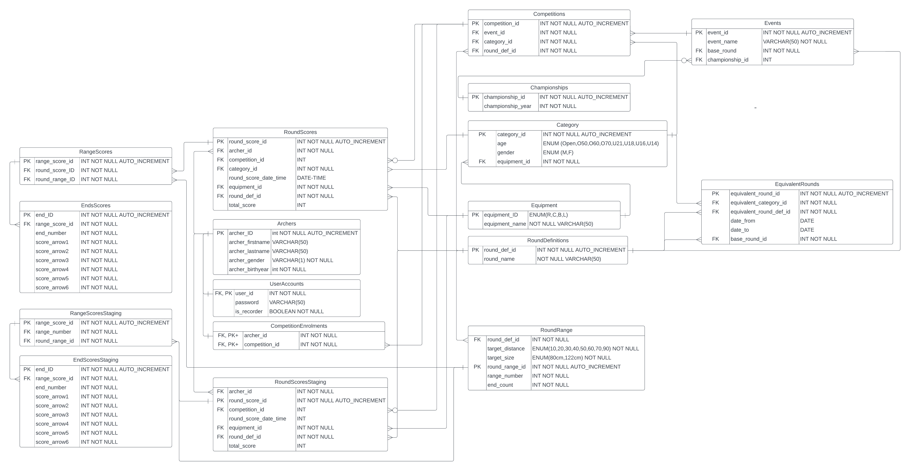

# Archery Database Recording Website

This repository contains the main deliverables of a project to create a database that records the scores for archery events.

## ER Diagram for the final website

## Folder Structure

### Database:
This contains contains an ER diagram of the database, the .sql files needed to build and populate the database, the python scripts that are used to generate the sql files, and a document that contains a description of how the database was populated.

### Website:
As a part of our major specific contributions, we created a simple web interface that can pull information from, and write information to the database. This website is written in PHP, and uses Bootstrap 5 for the styling. My specific contributions to the site were implementing the  styling, and writing the ‘View Scores’ page.